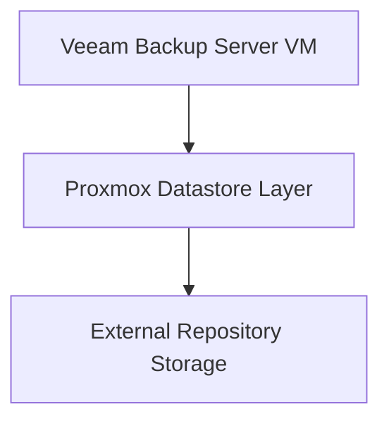

# Repository Design – Microsoft 365 Backup Lab

## Repository Architecture Overview

The Microsoft 365 backup repository is externalized from the backup server operating system disk and attached through the Proxmox datastore layer.

Logical storage flow:



This design separates compute and storage responsibilities and improves recovery flexibility.

---

## Repository Location Strategy

Repository storage is hosted on an external datastore presented to the backup VM through the Proxmox virtualization layer.

Repository role:

```
Primary Microsoft 365 backup storage target
```

Design objective:

```
Decouple backup server lifecycle from backup data lifecycle
```

This allows rebuilding the backup server without losing repository data.

---

## External Storage Benefits

Using external repository storage provides several advantages:

* separation between operating system and backup data
* simplified disaster recovery workflow
* rebuild-friendly architecture
* safer snapshot management strategy
* storage scalability independent from VM sizing

This mirrors common enterprise backup infrastructure practices.

---

## Integration with Proxmox Storage Layer

Repository storage is attached via the Proxmox datastore abstraction layer.

Benefits:

* centralized storage visibility
* flexible disk presentation
* simplified storage migration capability
* compatibility with multiple storage backends (USB, ZFS, NAS, future PBS)

This enables storage backend replacement without redesigning the backup architecture.

---

## Snapshot Compatibility Strategy

A Proxmox snapshot baseline is maintained for the backup server VM:

```
BASELINE-VEEAM-M365
```

Purpose:

* fast rollback capability
* safe configuration testing
* simplified recovery workflow

Snapshots protect the backup server configuration layer, while repository storage protects backup data.

---

## Recovery Scenario Design

Because repository storage is externalized, the backup server can be redeployed quickly if required.

Recovery workflow:

```
Deploy new Windows Server VM
Install Veeam Backup for Microsoft 365
Reconnect existing repository
Reconnect Entra ID App Registration
Resume backup jobs
```

This architecture ensures backup continuity even if the backup server VM becomes unavailable.

---

## Storage Layer Evolution Capability

The repository design supports future migration scenarios such as:

* migration to ZFS-backed datastore
* migration to NAS repository storage
* migration to Proxmox Backup Server
* migration to dedicated backup storage hardware

This ensures long-term scalability of the backup infrastructure.
